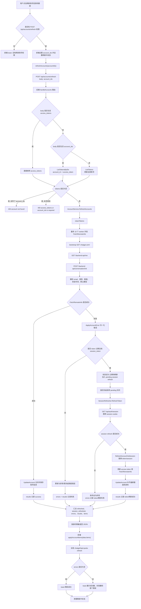

# 账号信息和额度刷新流程

本文说明前端点击“刷新账号信息和额度”后，`POST /api/accounts/refresh` 的完整执行链路。该流程主要用于重新拉取 ChatGPT Web 账号资料、账号类型、图片额度、恢复时间，并在 access token 过期且本地保存了 `session_token` 时尝试刷新 token。

## 入口

前端入口在 `web/src/app/accounts/page.tsx`：

- 单个账号行按钮：点击行内刷新按钮，调用 `handleRefreshAccounts([account.id])`。
- 顶部“一键刷新额度”：调用 `handleRefreshAccounts(accounts.map((item) => item.id))`。

`handleRefreshAccounts` 会先检查当前登录用户是否拥有 `POST /api/accounts/refresh` 权限，然后去重、过滤空 ID，设置全局刷新状态和行级刷新状态，再调用 `web/src/lib/api.ts` 中的 `refreshAccounts(accountIds)`。

API helper 固定发送：

```ts
POST /api/accounts/refresh
{
  "account_ids": ["..."]
}
```

刷新完成后，前端会：

- 用返回的 `items` 覆盖账号列表状态。
- 派发 `chatgpt2api:quota-refresh` 事件，让其它关心额度的组件刷新展示。
- 根据 `errors` 数组显示成功或失败 toast。
- 清理刷新中的 UI 状态。

## 后端路由

后端入口在 `internal/httpapi/routes.go` 的 `handleAccounts`：

1. 读取 JSON body。
2. 优先读取 `access_tokens`。
3. 如果没有 `access_tokens` 但传了 `account_ids`，通过 `AccountService.ListTokensByIDs(accountIDs)` 把账号 ID 映射回 access token。
4. 如果既没有 `access_tokens` 也没有 `account_ids`，默认刷新当前号池全部 token。
5. 如果最终 token 为空：
   - 传了 `account_ids`：返回 `404 account not found`。
   - 完全没有传参且号池为空：返回 `400 access_tokens or account_ids is required`。
6. 调用 `AccountService.RefreshAccounts(r.Context(), tokens)`。
7. 按当前身份执行账号 payload 脱敏。
8. 返回刷新结果。

账号 ID 不是数据库主键，而是由 `accountIDFromToken(token)` 生成的短 SHA1 ID。前端只传 ID，后端保留 token 映射和权限脱敏边界。

## 服务层两阶段刷新

核心实现是 `internal/service/account.go` 的 `RefreshAccounts`。它分为两个阶段。

### 第一阶段：并发拉取远端账号状态

`RefreshAccounts` 先清洗 token 列表，然后最多启用 10 个 worker 并发执行 `FetchRemoteInfo(ctx, token)`。

`FetchRemoteInfo` 使用浏览器模拟 HTTP client 访问 ChatGPT Web：

1. `GET https://chatgpt.com/` 做 bootstrap，提前暴露 Cloudflare、网络、代理等问题。
2. `GET /backend-api/me` 拉取用户基础信息，例如 email、user id。
3. `POST /backend-api/conversation/init` 拉取会话初始化信息，例如 `limits_progress`、默认模型等。
4. 根据 `limits_progress` 解析图片额度、恢复时间和额度未知状态。
5. 根据远端 payload 和 access token payload 判断账号类型。
6. 生成更新字段：
   - `email`
   - `user_id`
   - `chatgpt_account_id`
   - `type`
   - `quota`
   - `image_quota_unknown`
   - `limits_progress`
   - `default_model_slug`
   - `restore_at`
   - `status`

如果额度明确为 0，状态会设为 `限流`；否则为 `正常`。

第一阶段每个 token 都会生成一条 `results` 明细。成功时通过 `UpdateAccount(token, remoteInfo)` 合并账号信息、保存到存储，并记录“更新账号”日志。失败时进入错误处理。

### 第二阶段：过期 token 的 session 刷新

如果第一阶段失败，`RefreshAccounts` 会调用 `ApplyAccountError(token, "refresh_accounts", err)` 归一化错误并更新账号状态：

- token 过期且本地有 `session_token`：状态更新为 `过期待刷新`，并加入本次批量刷新队列。
- token 过期但没有 `session_token`：状态更新为 `异常`，额度清零；如果开启自动移除异常账号，则直接移除。
- token 被封或无效：状态更新为 `异常` 或自动移除。
- 额度限制：状态更新为 `限流`，额度清零。
- 其它错误：保留原始错误信息，计入 `errors`。

对进入队列的过期账号，`RefreshAccounts` 会串行调用 `SessionRefresher.RefreshToken(ctx, oldAccessToken, sessionToken)`。`SessionRefresher` 位于 `internal/service/session_refresher.go`，它通过：

```text
GET https://chatgpt.com/api/auth/session
Cookie: __Secure-next-auth.session-token=<session_token>
```

获取新的 `accessToken`、`sessionToken` 和 `expires`。

`SessionRefresher` 有两个保护：

- 同一个旧 access token 的刷新会用 `inFlight` 去重，避免重复请求。
- 全局最多 5 个 session refresh 并发。

在 `RefreshAccounts` 的批量刷新路径中，pending session refresh 是按优先级排序后串行执行的。刷新成功后：

1. `RefreshAccountViaSession(oldToken, newToken, newSessionToken, expires)` 替换账号 access token 和 session 信息，状态改为 `正常`。
2. 如果新 token 和旧 token 不同，会迁移本地图片额度预留计数和文本请求计数。
3. 再用新 token 调一次 `FetchRemoteInfo`，尽量补齐最新邮箱、类型和额度。
4. 更新对应 `results` 明细为成功，消息为 `token刷新成功`。

如果 session refresh 失败，账号状态会更新为 `异常`，并在 `errors` 和 `results` 中记录 `token刷新失败: ...`。

## Mermaid 流程图



## 返回数据

后端返回的主要字段：

- `items`：刷新后的账号列表，前端用它覆盖页面状态。
- `refreshed`：第一阶段直接拉取远端信息成功并更新的账号数。
- `session_refreshed`：第二阶段通过 `session_token` 成功刷新 access token 的账号数。
- `session_failed`：第二阶段刷新 token 失败的账号数。
- `errors`：失败列表，包含 `account_id`、`access_token` 和 `error`；返回前会按身份脱敏。
- `results`：逐账号刷新明细，包含 `success`、`status`、`message/error`、耗时、账号状态、邮箱、类型、额度、恢复时间等。
- `total`：本次处理的 token 数。
- `failed`：`errors` 数量。
- `duration_ms`：总耗时。

前端当前主要使用 `items`、`refreshed`、`errors` 展示结果；`results` 保留了更细的逐账号刷新诊断信息。

## 状态流转

常见状态流转如下：

| 场景 | 处理结果 |
| --- | --- |
| 远端信息拉取成功且额度大于 0 或额度未知 | `正常` |
| 远端信息拉取成功但额度明确为 0 | `限流` |
| access token 过期且有 `session_token` | `过期待刷新` -> session refresh 成功后 `正常` |
| access token 过期但没有 `session_token` | `异常`，额度清零，或按配置自动移除 |
| token 被封/无效 | `异常`，额度清零，或按配置自动移除 |
| 明确额度限制错误 | `限流`，额度清零 |
| session refresh 失败 | `异常` |

## 设计要点

- KISS：前端只提交账号 ID；后端集中完成 ID 到 token 的映射、远端刷新、状态更新和脱敏返回。
- YAGNI：刷新流程只处理当前需要的账号信息、额度和 session token 恢复，没有额外引入多套刷新策略。
- DRY：账号状态更新统一走 `UpdateAccount`，错误归一化统一走 `ApplyAccountError`，session token 刷新统一走 `SessionRefresher`。
- SOLID：前端页面负责交互状态，API helper 负责请求封装，HTTP 路由负责参数解析，`AccountService` 负责账号领域逻辑，`SessionRefresher` 只负责 session token 换取新 access token。

## 相关代码

- `web/src/app/accounts/page.tsx`：按钮、权限判断、刷新状态、toast。
- `web/src/lib/api.ts`：`refreshAccounts(accountIds)` 请求封装和返回类型。
- `internal/httpapi/routes.go`：`POST /api/accounts/refresh` 路由。
- `internal/service/account.go`：`RefreshAccounts`、`FetchRemoteInfo`、`ApplyAccountError`、`RefreshAccountViaSession`。
- `internal/service/session_refresher.go`：`SessionRefresher` 和 `/api/auth/session` token 刷新。
