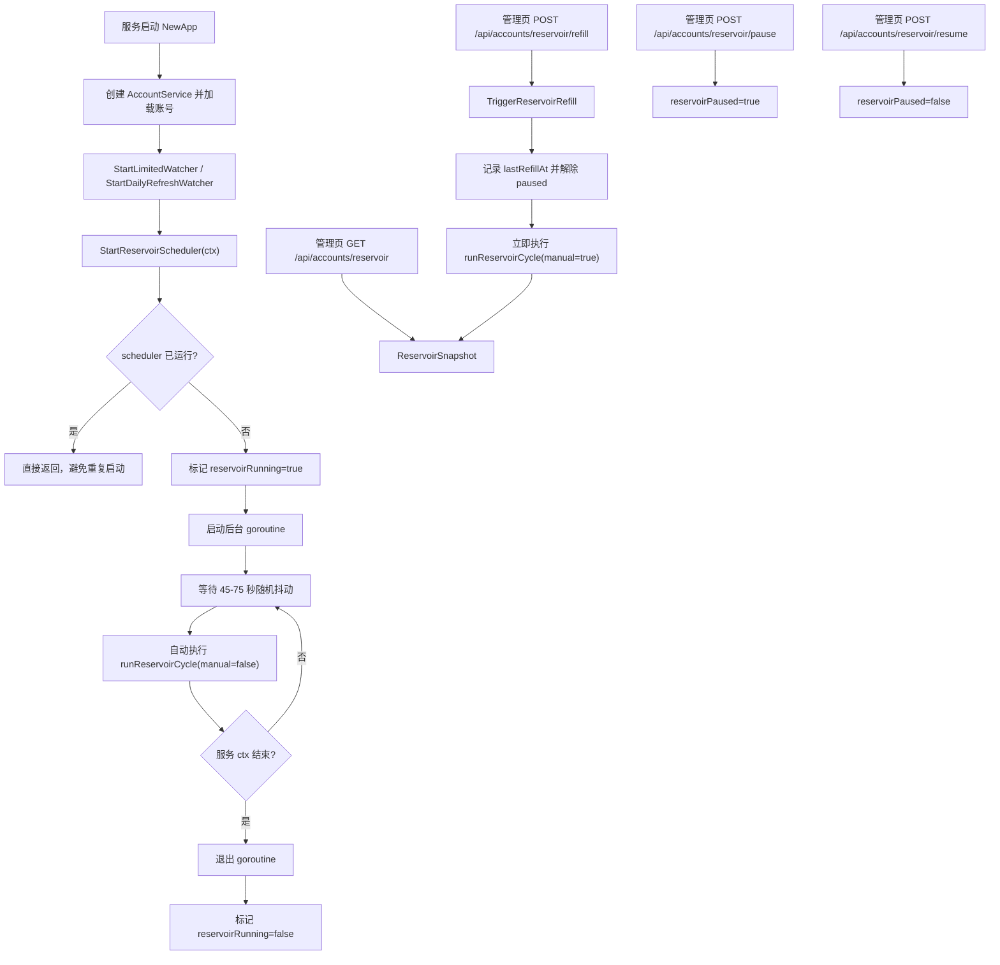
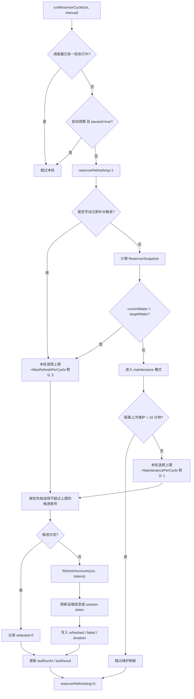
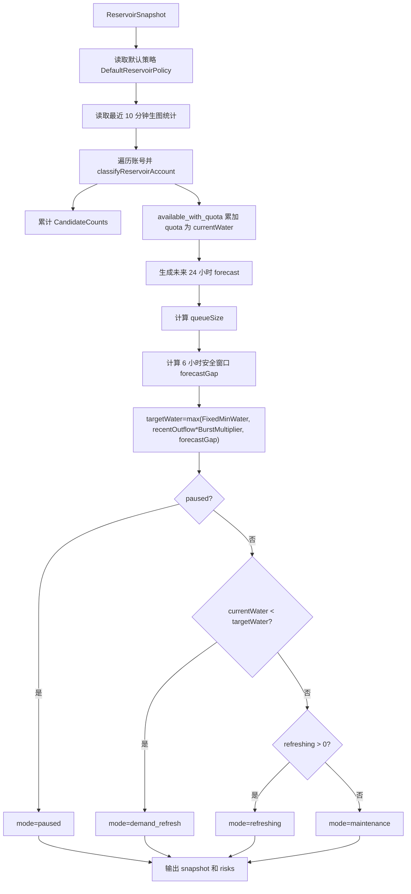
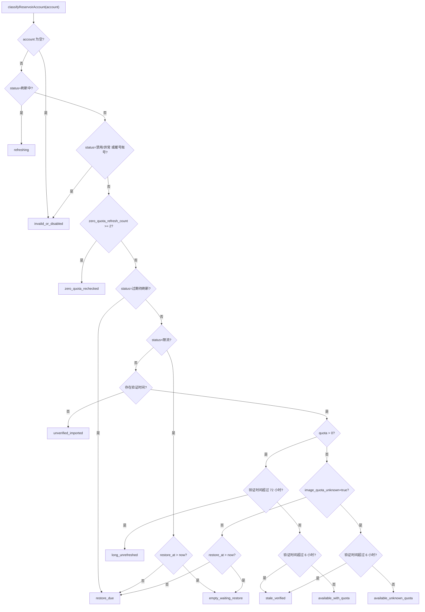
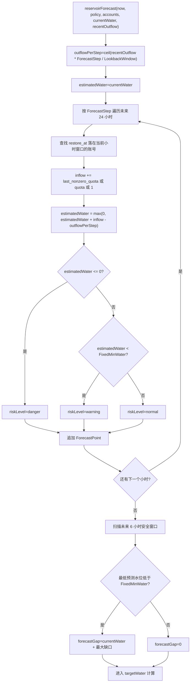
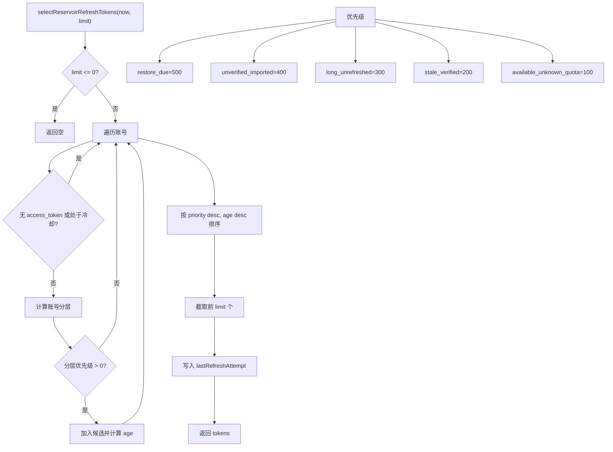
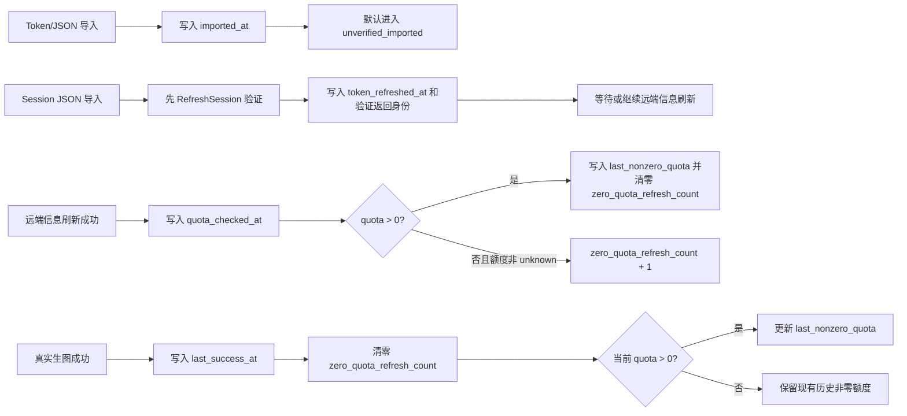

# 账号蓄水池管理器开发计划

> 目标：把账号额度刷新从“手动批量扫描”升级为持续运行、低速分散、可预测的动态调度机制，降低刚导入账号、过期 token、额度恢复集中、短时间高消耗带来的失败率和风控风险。
> 计划日期：2026-06-26
> 最新进度：2026-06-27 已完成 Phase 1、Phase 2、Phase 3 和 Phase 4 的第一轮基础实现；自动调度器已启用，未来 24 小时预测已接入快照、调度风险和管理页展示，配置化仍待推进。

## 当前进度

已完成：

- 新增 `internal/service/account_reservoir.go`，提供账号分层、当前水位、目标水位、最近 10 分钟出水统计、风险提示和快照。
- 新增 `GET /api/accounts/reservoir`、`POST /api/accounts/reservoir/refill`、`pause`、`resume`，并加入号池管理权限目录。
- 管理页新增“蓄水池状态”区域，展示当前水位、目标水位、最近 10 分钟调用/成功/失败、分层账号数、刷新队列和风险。
- 后台 scheduler 已启用，按随机抖动周期评估水位；水位不足时低速补水，水位充足时按维护节流刷新候选账号。
- 顶部“一键刷新额度”已迁移为“立即补水”，触发蓄水池调度而不是全量高并发扫描。
- 刚通过 token/JSON 导入的新账号写入 `imported_at`，默认进入 `unverified_imported`。
- 文本和生图选号已收敛：常规候选只允许 `available_with_quota` 和已验证的 `available_unknown_quota`，未验证导入账号不参与真实请求。
- 远端账号信息刷新成功后写入 `quota_checked_at`、`last_nonzero_quota`，并维护 `zero_quota_refresh_count`。
- session token 刷新成功后写入 `token_refreshed_at`。
- 真实生图成功后写入 `last_success_at`，并更新最近非零额度。
- `AddAccountFromSession` 会先通过 session token 验证并采用验证返回的身份/token，避免提交 JSON 中的伪造身份污染账号。
- 已新增未来 24 小时预测，按 `restore_at`、最近出水速度和 `last_nonzero_quota` 估算小时级水位，并在安全窗口跌破最低水位时提前提高目标水位。
- 管理页已展示预测水位、预计回流/出水和预测风险等级。
- 已新增 `internal/service/account_reservoir_test.go`，覆盖未验证导入账号不进入候选池、已验证有额度账号进入候选池，以及预测回流、保守估算和安全缺口。

已验证：

- `go test ./internal/service ./internal/httpapi ./internal/protocol -count=1`
- `cd web && npm run build`

暂未完成：

- 配置项接入设置页或配置文件，目前仍使用保守默认值。

## 背景

当前账号刷新主要依赖三类触发：

1. 管理员在账号页点击“刷新账号信息和额度”或“一键刷新额度”。
2. 后台 watcher 定时扫描 `限流` 且 `restore_at` 已到期的账号。
3. 真实对话或生图过程中，上游返回 token expired 后再触发 session token 刷新。

这套机制简单直接，但在大量 JSON 账号导入后会暴露几个问题：

- 刚导入账号本地会被规范化为 `正常`，但没有远端验证，`quota=0`、`restore_at=-` 也可能进入真实请求选号。
- 文本请求当前主要看账号状态，不优先排除图片额度为 0 或额度信息未知的账号，容易撞上已过期 access token。
- 现有手动刷新会在第一阶段最多 10 并发拉取远端信息，账号量很大时容易形成短时间集中请求。
- 如果大量账号长期未刷新，本地额度和 token 状态会失真，真实请求会承担探活成本。
- `restore_at` 集中到期后，如果到点才开始刷新，会造成集中补水和请求尖峰。

因此需要一个独立的 **Account Reservoir Manager（账号蓄水池管理器）**，把“可用额度”视为水池，把生图消耗视为出水，把账号刷新视为进水，通过持续预测和节流刷新维持稳定水位。

## 术语

- **水位**：当前可确认的可用图片额度总量，主要由 `status=正常` 且 `quota>0` 的账号贡献。
- **出水速度**：最近 10 分钟内的生图调用或成功生图次数，用于估算近期消耗速度。
- **进水速度**：调度器刷新账号并重新发现可用额度的速度。
- **额度恢复时间 `restore_at`**：ChatGPT 返回的图片额度预计恢复时间，不是 access token 过期时间。到点后需要重新刷新账号信息，才能确认额度是否恢复。
- **access token 过期时间**：与 `restore_at` 是两件事。正常 access token 生命周期约 10 天，但图片额度信息仍建议每天刷新，因为不刷新无法确认新一天是否恢复额度。
- **验证新鲜度**：账号最近一次成功刷新远端信息、成功刷新 token 或真实请求成功的时间。
- **未验证账号**：刚导入但没有成功远端刷新记录的账号，不应与已验证账号同等参与真实请求。

## 目标

- 新增独立的账号蓄水池管理器，集中管理账号分层、水位统计、未来水位预测和刷新调度。
- 文本请求和生图请求都优先选择有额度且验证新鲜的账号，避免用真实请求探测刚导入账号。
- 刚导入账号默认进入未验证池，等待调度器低速刷新验证后再进入可用池。
- 用固定最低水位和动态目标水位共同决定补水需求。
- 统计最近 10 分钟生图消耗，按消耗速度动态提高刷新预算。
- 基于 `restore_at` 做未来 24 小时水位预测，提前发现水位塌陷风险。
- 在水位足够时仍执行低频维护刷新，避免账号长期不刷新。
- 保留手动入口，但把“一键刷新额度”改为“触发蓄水池调度/立即补水”，不再默认全量高并发扫描。
- 管理页展示蓄水池核心状态、预测、刷新队列和风险提示。

## 非目标

- 第一阶段不实现复杂机器学习预测。
- 第一阶段不保证精确预测恢复后的完整额度，只做保守估算。
- 第一阶段不绕过现有 `AccountService` 重新实现 ChatGPT 请求细节。
- 第一阶段不引入多套兼容路径或旧刷新逻辑的长期并存层；稳定后应逐步让手动刷新走调度器。
- 第一阶段不把文本额度、用户订阅计费额度与图片额度混为一个水池。

## 设计原则

- **KISS**：先实现可解释的规则调度，不引入复杂策略引擎。
- **YAGNI**：只为当前账号刷新、额度预测和风控节流服务，不预留无明确需求的多租户策略 DSL。
- **SRP**：账号服务负责账号数据和远端刷新；蓄水池管理器负责分类、预测和调度。
- **DRY**：刷新动作复用现有 `AccountService.RefreshAccountState`、`RefreshAccountViaSession`、`FetchRemoteInfo` 等能力。
- **OCP**：调度策略通过 policy 参数扩展，避免把阈值和速度写死在刷新函数中。

## 模块边界

建议新增服务模块：

```text
internal/service/account_reservoir.go
```

核心职责拆分：

- `Classifier`：按账号状态、额度、恢复时间、验证新鲜度进行分层。
- `Forecaster`：基于当前水位、最近消耗和未来 `restore_at` 预测未来水位。
- `Scheduler`：根据缺口、风险和策略预算选择刷新候选账号。
- `Telemetry`：记录最近生图消耗、刷新结果和当前队列状态。

蓄水池管理器不直接构造 ChatGPT HTTP 请求。它只调用账号服务提供的刷新能力，并返回可展示、可测试的状态快照。

## 生命周期和工作流程图

### 整体生命周期

服务启动后会创建 `AccountService`，加载账号数据，并在 HTTP 应用初始化阶段调用 `accounts.StartReservoirScheduler(ctx)`。调度器是后台常驻协程，直到服务上下文取消才退出；管理页的“暂停调度”只暂停自动周期，“恢复调度”重新允许自动周期执行，“立即补水”是人工触发一次调度决策。



### 自动周期和手动补水

自动周期每轮先检查蓄水池调度器是否已有一轮执行中，避免两轮调度重入；这里不是指单个账号的 `status=刷新中`。如果处于暂停状态，自动周期不执行。手动“立即补水”会解除暂停并直接跑一轮，但仍只按候选优先级低速选择少量账号，不会全量高并发扫描。`limit` 表示本轮最多选择多少个账号刷新，不表示并发数。



### 快照和目标水位计算

`ReservoirSnapshot` 是管理页展示、调度决策和风险提示的统一入口。它先按账号分层计算当前确定水位，再结合最近 10 分钟出水和未来 24 小时预测得出目标水位。



### 账号分层判断

分层逻辑优先排除不能刷新或不应参与真实请求的账号，再根据验证新鲜度、额度、恢复时间和连续 0 额度次数决定层级。常规文本和生图候选只允许 `available_with_quota` 与已验证的 `available_unknown_quota`。



### 未来水位预测和安全缺口

预测以当前确定水位为起点，按小时扣减最近出水速度折算的预计出水，并把落在该小时窗口内的 `restore_at` 账号按 `last_nonzero_quota` 或保守值 1 计入预计回流。安全窗口内任一点低于最低水位时，会把缺口折算进目标水位，触发提前补水。



### 刷新候选选择

每轮刷新先过滤无 token、处于 `refresh_cooldown_until` 或刚刷新过的账号，再只保留有刷新优先级的层级。候选排序是“优先级高优先，其次更久未验证/导入的账号优先”。



### 数据流和状态更新

蓄水池依赖账号的新鲜度字段判断可信度；这些字段只在明确事件发生时写入，避免用推测状态污染候选池。




## 账号分层

第一版建议使用以下逻辑分层：

| 分层 | 条件 | 是否参与真实请求 | 调度动作 |
| --- | --- | --- | --- |
| `available_with_quota` | `status=正常`、`quota>0`、验证信息新鲜 | 优先参与文本和生图 | 低频维护刷新 |
| `available_unknown_quota` | `status=正常`、额度未知，但最近验证成功 | 可作为次级文本候选，生图谨慎使用 | 进入普通刷新候选 |
| `unverified_imported` | 刚导入、无成功刷新记录 | 不参与真实请求 | 优先低速验证和暖号 |
| `empty_waiting_restore` | `quota=0`、`restore_at>now` | 不参与真实请求 | 等待恢复时间 |
| `restore_due` | `quota=0`、`restore_at<=now` | 不参与真实请求 | 高优先级刷新 |
| `stale_verified` | 曾经验证成功，但信息超过新鲜度窗口 | 降级参与或不参与 | 维护刷新 |
| `long_unrefreshed` | 超过 3 天未成功刷新额度 | 不优先参与真实请求 | 进入维护刷新和暖号 |
| `zero_quota_rechecked` | 连续刷新 2 次仍为 0 额度 | 不参与真实请求 | 标记异常或进入人工检查 |
| `refreshing` | 当前正在刷新 | 不重复参与 | 等待结果 |
| `invalid_or_disabled` | `异常`、`禁用`、不可刷新 | 不参与 | 跳过或等待人工处理 |

刚导入账号默认不应进入 `available_with_quota`。只有满足以下任一条件后才进入可用池：

- 账号信息和额度刷新成功。
- session token 刷新成功，并且随后远端账号信息刷新成功。
- 真实请求成功，并记录 `last_success_at`。

刚导入账号不是直接禁用，而是进入低速验证和暖号流程。调度器应持续、分散地处理这类账号，避免账号长期沉睡；但在验证成功前，不让它们污染真实请求候选池。

连续 0 额度账号的处理建议：

1. 第一次刷新后仍为 0 额度：保留账号，记录 `zero_quota_refresh_count=1`，等待下一次调度。
2. 第二次刷新后仍为 0 额度：标记为 `异常` 或单独的待人工检查状态，避免继续消耗刷新预算。
3. 如果后续人工重新导入或手动恢复，再清除连续 0 额度计数。

## 选号策略调整

文本请求和生图请求都应优先选择可信账号：

1. `available_with_quota`
2. `available_unknown_quota` 且最近验证成功
3. 其它已验证正常账号

`unverified_imported`、`restore_due`、`empty_waiting_restore`、`refreshing`、`invalid_or_disabled` 不应作为常规真实请求候选。

最多切换 5 次账号时，也应在上述优先级内切换，而不是只按 `status=正常` 选择。

## 水位算法

固定最低水位和动态目标水位取最大值：

```text
target_water = max(
  fixed_min_water,
  recent_10m_usage * burst_multiplier,
  projected_usage_for_next_window,
  forecast_safety_gap
)
```

建议第一版字段：

```go
type ReservoirPolicy struct {
    FixedMinWater        int
    LookbackWindow       time.Duration // 默认 10 分钟
    ProjectionWindow     time.Duration // 默认 30 分钟
    ForecastWindow       time.Duration // 默认 24 小时
    ForecastStep         time.Duration // 默认 1 小时
    ForecastSafetyWindow time.Duration // 默认 6 小时
    BurstMultiplier      float64
    StaleAfter           time.Duration
    LongUnrefreshedAfter time.Duration
    ZeroQuotaMaxRechecks int
    MaxRefreshPerCycle   int
    MaintenancePerCycle  int
}
```

其中：

- `current_water`：当前确定可用额度。
- `recent_10m_usage`：最近 10 分钟生图消耗。
- `projected_usage_for_next_window`：按最近速度估算未来短窗口消耗。
- `forecast_safety_gap`：未来预测水位低于安全线时需要提前补的缺口。

## 未来水位预测

`restore_at` 表示额度预计恢复时间，不表示 access token 过期。调度器可以用它预测未来 24 小时每小时的水位变化。

第一版预测方式：

1. 以当前确定水位作为起点。
2. 按最近 10 分钟或更平滑窗口估算每小时消耗。
3. 对 `restore_at` 落在未来窗口内的账号，按小时加入预计回流水位。
4. 如果账号历史上有非零额度，使用最近一次非零额度作为恢复估计。
5. 如果没有历史额度，使用账号类型默认值或保守值。
6. 未验证账号不计入确定水位，只计入潜在补水候选。

输出示例：

```go
type ReservoirForecastPoint struct {
    At                  time.Time
    EstimatedWater      int
    EstimatedInflow     int
    EstimatedOutflow    int
    RestoreDueAccounts  int
    RiskLevel           string
}
```

预测用于提前反推刷新速度：如果未来 6 到 24 小时内会跌破安全线，调度器应从现在开始少量、分散刷新，而不是临近恢复点再集中刷新。

## 刷新调度策略

调度器持续运行，周期性评估水位和候选账号。

建议第一版行为：

- 每 45 到 75 秒评估一次水位，加入随机抖动。
- 每轮根据策略预算选择少量候选账号刷新；`MaxRefreshPerCycle` 是缺水或手动补水时的本轮选择上限，当前默认 3，`MaintenancePerCycle` 是水位充足时的维护选择上限，当前默认 1。
- 水位低于目标值时进入 `demand_refresh`。
- 水位充足时进入 `maintenance_refresh`，低频刷新长期未验证或信息过旧账号；当前实现还会用 10 分钟维护间隔避免每个周期都刷新。
- session refresh 和普通 quota refresh 都受限速控制。
- 同账号设置冷却时间，避免短时间反复刷新。
- 刷新失败进入失败冷却，不立即重试。

候选优先级：

1. `restore_due`：恢复时间已到，可能已经重新有额度。
2. `unverified_imported`：刚导入但未验证。
3. `long_unrefreshed`：超过 3 天未成功刷新。
4. `stale_verified`：曾经可用但信息过旧。
5. `available_unknown_quota`：已验证但额度未知，需要重新确认。

## 手动入口调整

保留账号管理页的手动按钮，但建议改名，避免“一键刷新额度”误导用户认为会立即刷新全部账号。

候选名称：

- `立即补水`
- `触发蓄水池调度`
- `启动手动补水`

按钮语义：

- 立即重新计算水位。
- 临时提高一小段时间内的刷新预算，用于管理员刚导入账号、刚恢复服务或发现水位显示异常时主动加速调度。
- 优先处理未验证、恢复到期、信息过旧账号。
- 仍遵守本轮选择上限、账号刷新冷却和失败冷却；本轮选择上限不等同于并发数。

如确需保留强制全量扫描，应作为高级危险操作，增加二次确认，并在 UI 中明确提示会产生大量上游请求。

因为调度器平时会持续运行，`立即补水` 不是日常必需操作。它的定位是“人工加速一次调度决策”，不是替代后台自动管理。

## 管理页面展示

账号管理页建议新增“蓄水池状态”区域，展示：

- 当前确定水位。
- 固定最低水位。
- 动态目标水位。
- 最近 10 分钟生图调用数、成功数、失败数。
- 按当前速度估算的耗尽时间。
- 未来 24 小时水位预测。
- 待刷新账号数：恢复到期、未验证、信息过旧、失败冷却。
- 当前刷新队列：等待中、刷新中、最近失败。
- 最近 10 分钟刷新速度和成功率。
- 风险提示：例如水位低于目标、未来水位塌陷、未验证账号过多、恢复时间集中。

前端不应只展示一个“刷新中”布尔值，而应展示调度器状态，方便判断它是在正常维护、紧急补水，还是处于冷却。

## 后端接口草案

第一版可以新增或扩展以下管理接口：

```text
GET  /api/accounts/reservoir
POST /api/accounts/reservoir/refill
POST /api/accounts/reservoir/pause
POST /api/accounts/reservoir/resume
```

`GET /api/accounts/reservoir` 返回快照：

```go
type ReservoirSnapshot struct {
    Enabled              bool
    Mode                 string
    Paused               bool
    Running              bool
    CurrentWater         int
    FixedMinWater        int
    TargetWater          int
    RecentOutflow10m     int
    RecentCalls10m       int
    RecentSuccess10m     int
    RecentFailure10m     int
    EstimatedDepletionAt *time.Time
    CandidateCounts      map[string]int
    Refreshing           int
    QueueSize            int
    LastRunAt            *time.Time
    LastRefillAt         *time.Time
    LastResult           map[string]any
    Forecast             []ReservoirForecastPoint
    Risks                []string
    UpdatedAt            time.Time
}
```

`POST /api/accounts/reservoir/refill` 表示手动补水信号，而不是全量刷新命令。

## 数据字段建议

为支持新鲜度和预测，账号记录建议逐步补充：

- `quota_checked_at`：最近一次成功刷新额度时间。
- `token_refreshed_at`：最近一次成功刷新 access token 时间。
- `last_success_at`：最近一次真实请求成功时间。
- `last_nonzero_quota`：最近一次观察到的非零额度。
- `imported_at`：导入时间。
- `refresh_cooldown_until`：失败或限速后的冷却结束时间。
- `zero_quota_refresh_count`：连续刷新后仍为 0 额度的次数。

这些字段共同构成“新鲜度字段”。它们用于回答账号状态是否可信：额度多久没刷新、token 最近是否换过、账号最近是否真实请求成功、导入后是否完成验证。

迁移期需要给旧账号合理默认值，避免把所有旧账号一次性误判为未验证或过旧。建议：

- 已有 `quota>0` 且 `status=正常` 的账号，初始视为已验证，但 `quota_checked_at` 为空时进入维护刷新队列。
- 已有 `quota=0` 且 `restore_at` 已到期的账号，进入 `restore_due`。
- 已有 `quota=0` 且无 `restore_at` 的账号，进入待验证或维护刷新，不直接参与真实请求。
- 新导入账号明确写入 `imported_at`，并进入 `unverified_imported`。

## 配置建议

建议新增配置项，默认保守：

| 配置键 | 默认值 | 说明 |
| --- | --- | --- |
| `account_reservoir_enabled` | `true` | 是否启用蓄水池管理器 |
| `account_reservoir_min_water` | `200` | 固定最低水位，即希望至少维持的确定可用图片额度 |
| `account_reservoir_max_refresh_per_cycle` | `3` | 缺水或手动补水时，每轮最多选择的刷新账号数 |
| `account_reservoir_maintenance_per_cycle` | `1` | 水位充足时，每轮维护最多选择的刷新账号数 |
| `account_reservoir_stale_after_minutes` | `360` | 账号信息超过多久视为过旧 |
| `account_reservoir_maintenance_interval_minutes` | `10` | 水位充足时，两次维护刷新之间的最小间隔 |

这些值后续可以根据真实运行日志调整。第一版宁可慢一点，也不要形成刷新尖峰。

## 迭代交付顺序

### Phase 1：观测和数据补齐（已完成第一版）

- [x] 复用当前已有的成功/失败调用统计，支持最近 10 分钟出水速度计算；第一版已通过日志统计最近 10 分钟生图调用、成功、失败和实际出水。
- [x] 为账号记录补充 `quota_checked_at`、`token_refreshed_at`、`last_success_at`、`last_nonzero_quota`、`imported_at`、`zero_quota_refresh_count` 等基础字段。
- [x] 新增蓄水池快照计算，但不接管刷新调度。
- [x] 管理页先展示只读水位、最近 10 分钟消耗、分层统计和风险提示。

### Phase 2：选号策略收敛（已完成第一版）

- [x] 文本和生图选号优先 `available_with_quota`，并允许已验证的 `available_unknown_quota` 作为次级候选。
- [x] 刚导入未验证账号不参与常规真实请求。
- [x] 最多 5 次切换账号时，基于收敛后的文本候选池进行切换，未验证账号不会进入切换候选。

### Phase 3：低速动态调度（已完成第一版）

- [x] 新增后台 scheduler。
- [x] 实现 `restore_due`、`unverified_imported`、`stale_verified`、`long_unrefreshed` 的轻量刷新候选队列。
- [x] 手动按钮改为“立即补水”，触发调度器而不是全量扫描。
- [x] 默认小批量选择、刷新冷却、维护节流和随机抖动。
- [x] 管理页提供暂停/恢复调度器按钮，便于排查和人工干预。

### Phase 4：未来水位预测（已完成第一版）

- [x] 基于 `restore_at` 和最近消耗生成未来 24 小时预测。
- [x] 使用 `last_nonzero_quota` 估算恢复回流；没有历史非零额度时使用保守值 1。
- [x] 当预测水位在安全窗口内跌破最低水位时，提高目标水位并提前补水。
- [x] 管理页展示预测水位、预计回流/出水和风险提示。

### Phase 5：替换旧全量刷新语义

- 将原“一键刷新额度”彻底迁移到蓄水池调度。
- 保留强制全量扫描为高级诊断能力或移除。
- 更新部署和运维文档。

## 测试计划

后端单元测试：

- 账号分层分类。
- 刚导入账号不进入真实请求候选。
- `restore_at<=now` 的账号进入高优先级刷新候选。
- 固定最低水位和动态目标水位取最大值。
- 未来 24 小时预测按小时累计出水和回流。
- 调度器遵守本轮选择上限、刷新冷却、维护节流和失败冷却。

集成测试：

- 大量刚导入账号不会污染文本请求候选池。
- 手动补水只提高本轮选择上限，不触发无上限全量扫描。
- 过期 token 通过刷新队列处理后更新状态和额度。

前端验证：

- 账号页展示当前水位、目标水位、最近消耗、队列和风险提示。
- “立即补水”按钮文案和行为与新语义一致。
- 刷新队列和风险状态不会造成布局跳动。

## 风险和待确认问题

- 恢复后的额度估计不一定准确，第一版必须标注为预测值，不应当作真实额度。
- 当前已有成功和失败调用统计，第一版先复用该统计作为最近 10 分钟出水速度来源。
- 旧账号数据缺少新鲜度字段，迁移期按现有 `status`、`quota`、`restore_at` 推断初始分类，避免误判所有账号。
- 多实例部署时，调度器需要避免多个进程同时刷新同一批账号；第一版仅考虑单实例。
- 当前没有 IP 代理池，第一阶段暂不考虑账号到出口 IP 的稳定绑定。

## 开放问题

1. 出水速度最终采用“生图请求提交数”“成功生成数”还是两者加权？第一版先复用现有成功/失败统计，并保守估算。
2. `fixed_min_water` 初始按 200 设计，后续是否需要按账号总数或业务负载动态调整？
3. 未验证账号是否允许在无任何可用账号时作为最后兜底？当前建议不允许，避免真实请求探活。


